# scholarship-watchdog

An autonomous agent that watches scholarship websites so a deadline never passes unnoticed.

It runs unattended once a week on GitHub Actions, detects which pages actually changed, extracts each opportunity into one normalised record with an LLM, scores it against a private eligibility profile in plain Python, and emails only what is new or has materially moved.

**Status: specification complete and reviewed, registry verified, implementation starting at P1.** This repository is being built in the open, spec first. What that means and why is in [`docs/process.md`](docs/process.md).

## The problem

Scholarship information sits on a few dozen institutional pages that change rarely and without announcement. The only reliable way to catch a new programme or a moved deadline is to re-read all of them regularly, which is tedious enough that it does not happen. Missed deadlines are unrecoverable.

## How it works

Every registered page is fetched and hashed. Only pages whose content actually changed reach the model, which is the primary cost control: a typical week costs close to nothing regardless of how many sources are registered.

<p align="center"></p>

Sources carry a role. A `watch` source guards one programme's deadline and alerts if it ever stops yielding one. A `discover` source is a portal skimmed for programmes not yet seen; a candidate found there is verified by a real extraction of its own page before it can join the watch list.

<p align="center"></p>

Both diagrams are generated from the `.mmd` sources in [`diagrams/`](diagrams/); [`SPEC.md`](SPEC.md) section 3 embeds the same sources as native mermaid.

## Three decisions worth explaining

**The model reads; deterministic code decides.** Reading unstructured admissions prose is a fuzzy task an LLM does well. Deciding eligibility is an exact task it does unreliably. Extraction is a model call; scoring is plain Python with zero LLM involvement, so a verdict is reproducible and every rejection traces to a named rule.

**Value Accuracy, not JSON Pass Rate.** Every current model emits schema-valid JSON around 98% of the time, so schema compliance cannot separate them. What separates them is whether the extracted values are *correct*, and the two diverge by 15 to 30 points. A record can parse cleanly, validate against the schema, and still carry the wrong deadline, which produces a wrong eligibility verdict with nothing raising an error. [`docs/model-selection.md`](docs/model-selection.md) has the benchmark, the statistical argument, and the strongest objection to the choice made.

**Anything shaped by the profile is private, including every artifact produced by acting on it.** This repository is public. Extracted scholarship records are public information and are committed; scores, notifications, the notified log and the auto-grown watch list are not, because eligibility is reconstructible by inference from what got selected. That rule was rediscovered four times in four different places before it was stated once, which is why it now carries a testable invariant.

## Running it

Requires Python 3.12. Not yet runnable: the specification and registry are complete, and implementation begins at P1.

```bash
cp config/profile.example.yaml config/profile.yaml   # then fill it in; gitignored
python scripts/probe_sources.py                      # the registry gate
```

An `age` recipient key and a Firecrawl key are optional. Without them the system runs in report-only mode: nothing is promoted or persisted privately, and JavaScript-rendered sources are skipped with a warning.

## Repository layout

| Path | What |
| --- | --- |
| [`SPEC.md`](SPEC.md) | the contract: architecture, schema, scoring, privacy, phases |
| [`docs/model-selection.md`](docs/model-selection.md) | why this model, with a dated decision log |
| [`docs/process.md`](docs/process.md) | the five development stages |
| [`docs/git-conventions.md`](docs/git-conventions.md) | branching, commits, the orphan `data` branch |
| [`docs/design/`](docs/design/) | design documents |
| [`config/`](config/) | source registry and templates for the private files |
| [`scripts/probe_sources.py`](scripts/probe_sources.py) | checks every source still carries what the schema expects |
| [`diagrams/`](diagrams/) | `.mmd` sources; rendered files are generated from them |

## Licence

MIT. See [`LICENSE`](LICENSE).
