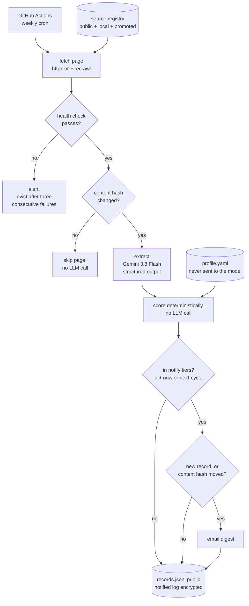
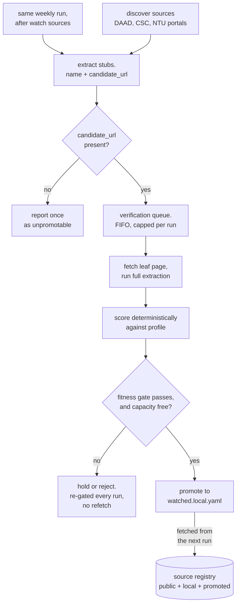

# scholarship-watchdog: specification

Version 0.1 · 2026-09-03 · Reviewed three times, findings applied. Registry rebuilt and verified. Nothing outstanding before implementation.

## 1. Problem

Scholarship information is scattered across a few dozen institutional pages (CSC/CampusChina, DAAD, individual university admissions sites). These pages change rarely and without announcement, so the only reliable way to catch a new opportunity or a moved deadline is to re-read all of them regularly. Doing that by hand is tedious enough that it does not happen, and missed deadlines are unrecoverable.

`scholarship-watchdog` is an autonomous agent that does the reading. It runs unattended on a weekly schedule, detects which sources actually changed, extracts each opportunity into one normalized record, scores it against a private eligibility profile, and raises a notification only for new or materially changed high-fit findings.

The author is its production user. The system is judged on whether it surfaces a real scholarship in time, not on demo output.

## 2. Design principles

Three constraints shape every decision below.

**Cost is controlled by not calling the model.** The expensive stage is extraction. A source whose content has not changed since the last run is skipped before extraction, so a typical week costs close to nothing regardless of how many sources are registered.

**The model reads; deterministic code decides.** Reading unstructured admissions prose is a fuzzy task and the LLM is good at it. Deciding whether the user is eligible is an exact task and the LLM is unreliable at it. Extraction is an LLM call; scoring is plain Python with zero LLM involvement, so an eligibility verdict is reproducible and auditable.

**The private profile never leaves the machine.** Citizenship, residency, certificates and age are inputs to scoring and are never committed, logged, or sent to any third party.

## 3. Architecture

**The weekly run.** Every registered page is fetched, and only pages that actually changed reach the model.



**How a source enters that registry.** Discover sources are skimmed for programmes not yet seen. A candidate is verified by a real extraction of its own page before it is promoted, so nothing joins the watch list unchecked.



Rendered copies live in [`diagrams/`](diagrams/): `.svg` and `.png` for embedding, `.excalidraw` for editing. The `.mmd` sources above are the single source of truth; the artifacts are regenerated from them. The stage-by-stage detail behind these two views is in sections 3.1 to 3.6.

### 3.1 `fetch`

Retrieval sits behind a `Fetcher` protocol with two implementations, selected per source in the registry.

`HttpxFetcher` is the default: `httpx` retrieves the page and `trafilatura` reduces the HTML to clean markdown, discarding navigation, footers and scripts. It is free and sufficient for DAAD and most static university pages.

`FirecrawlFetcher` covers JavaScript-rendered sources. CampusChina and several university portals return an empty application shell to a plain HTTP client, so `httpx` retrieves markup with no content in it and `trafilatura` has nothing to extract. Firecrawl renders the page in a real browser and returns the finished text. It costs credits, so it is opt-in per source rather than the default:

```yaml
- url: https://www.daad.de/...
  fetcher: httpx        # static, free
- url: https://www.campuschina.org/...
  fetcher: firecrawl    # JS-rendered
```

The protocol keeps the paid provider swappable and keeps the core runnable without a Firecrawl key: a source configured for `firecrawl` when no key is present is skipped with a warning rather than failing the run.

Per-source politeness applies to both: honest user agent identifying the project and its repository, rate limiting between requests, bounded retries with exponential backoff, and a per-source page cap.

**Every source declares a `role`, and the role determines what is demanded of it.**

An audit of the first draft registry found that none of its eleven static sources contained a deadline in the fetched text: every one was an index or overview page, with deadlines, stipends and nationality rules a click deeper. Because every schema field is optional-typed, this failed silently: it produced schema-valid records with null deadlines and no error anywhere. Those were not fourteen broken URLs. They were fourteen sources doing a job they are good at, labelled as a job they cannot do.

`watch` guards a deadline: one programme, one page, checked weekly. A watch source that stops yielding a deadline, or yields no records at all, is broken by definition and alerts. This is the guard the original registry lacked.

`discover` finds programme names and links on portal and index pages. Missing dates are expected and never alert, and its records are capped at `shortlist` until promotion gives them a real page. A discover source that has never yielded a candidate is flagged once in the digest after its first successful extraction, so that a portal fetching cleanly while producing nothing cannot pass as a quiet week.

Role replaces the earlier `expects_dates` flag, which was a patch over this missing distinction.

**Discover-role cleaning preserves hyperlink targets.** Default trafilatura cleaning discards `href` attributes with the navigation, which would leave the extractor reading programme names as text with no link to follow. Hrefs are canonicalised before hashing, so a portal rotating tracking parameters does not register as changed.

A bounded one-level crawl (`follow_links`) was specified in an earlier draft and is removed. Discovery plus promotion reaches the same leaf pages and verifies each one before adopting it, which the crawl did not. The condition for re-adding it is recorded in `docs/design/2026-08-29-source-model-design.md`: run reports showing discovery consistently fails to surface links on index pages.

**Snapshots are keyed by `(source_id, page_url)`**, so each page hashes and advances independently.

**Change detection operates on the cleaned markdown, not the raw HTML.** Raw HTML carries render timestamps, session tokens, visitor counters and rotating banners, all of which change on every fetch without the content changing. Hashing post-extraction text removes that noise, so a detected change is far more likely to be a real content change. Each run stores the markdown snapshot and compares its SHA-256 against the previous snapshot; when they differ, a unified diff is retained for the run report.

An unchanged page terminates the pipeline for that page. This is the primary cost control.

**Health checks run before the skip gate**, because a broken source is by construction unchanged after its first broken fetch: the error page becomes the stored snapshot, the next run sees no change, and any alarm placed after the gate can never fire. Checking the fetch result rather than the extraction count is what makes breakage detectable at all.

| Check | Alerts when |
| --- | --- |
| Content collapse | cleaned markdown is under 40% of the previous snapshot |
| Error signature | text matches "enable JavaScript", "Access Denied", a bare 4xx/5xx page |
| Skipped source | a source is skipped twice running (missing Firecrawl key, repeated fetch failure) |

A per-source staleness figure is reported in the run report but does not alert. Scholarship pages legitimately go six to twelve months unchanged, so any configured cadence would either never fire or cry wolf, and there is no data to tune fourteen of them against.

### 3.2 `extract`

Changed pages go to an LLM with structured output, producing zero or more records against one normalized Pydantic schema. Like fetching, extraction sits behind an `Extractor` protocol and the model is a config value, never a hardcoded call.

The default is **Gemini 3.8 Flash** via the Gemini API, with `responseSchema` enabled. Benchmark differences between the leading candidates fall inside statistical noise at this project's volume, so the default is chosen on operational grounds: a free tier that covers the eval loop, a current-generation model ID that will not be deprecated under an unattended cron, and one first-party SDK. `docs/model-selection.md` records the full comparison, the statistical argument, and the strongest objection to this choice.

Value Accuracy, whether extracted values are actually correct, is the metric this project selects on. JSON Pass Rate saturates near 100% for every current model and cannot separate them: a record can parse cleanly, validate against the schema, and still carry the wrong deadline, which produces a wrong eligibility verdict with nothing raising an error.

The extracted schema:

| Field | Notes |
| --- | --- |
| `program` | identity field; the only model-produced component of the identity hash |
| `institution` | nullable, defaulting to a per-source value from the registry. Government schemes (CSC, MEXT, DAAD, Fulbright) have no stable institution, and asking the model to invent one produced a different answer each run |
| `degree_level` | bachelor / master / phd / postdoc |
| `language_of_instruction` | |
| `funding_type` | full / partial / tuition-only / none |
| `stipend` | amount and currency when stated |
| `deadline` | ISO date; null when the page gives none |
| `deadline_raw` | the original date string, preserved verbatim |
| `nationality_restrictions` | eligible or excluded nationalities |
| `language_certificate` | required certificate and minimum score |
| `experience_requirement` | |
| `application_route` | direct to university / via agency / via embassy |
| `source_url` | provenance: the page this record was extracted from |
| `candidate_url` | nullable, discover-role only: the leaf page this listing points at. Excluded from both hashes. A null value is the unpromotable case |

Every field is optional-typed rather than guessed: absence is recorded as absence, because a hallucinated deadline is worse than a missing one. Section 3.3 defines what each absence means to scoring, so that optional typing does not silently push the decision into whatever the code happens to do.

**Dates are the highest-risk field.** `04.03.2027` is 4 March in Germany and 3 April in the United States, and a silent transposition produces a confidently wrong deadline, which is the failure this project exists to prevent. Three mitigations: the source's `country` from the registry is passed to the extraction prompt as a date-convention hint; `deadline_raw` preserves the original string so a bad parse is auditable rather than invisible; and the golden set must include a German `DD.MM.YYYY` page, a fuzzy date ("mid-October"), and a date with no year, where the year has to be inferred relative to the run date.

A registry `country` may be null, and must be for a multi-country portal. Fulbright's international site links to roughly 160 national commission pages; a commission page inheriting `US` would be given the wrong date convention, producing exactly the transposition above. Where `country` is null, extraction infers it from the page.

Discover-role extraction is a distinct case of the same call: it is asked for programme names and their links rather than full records, resolves relative hrefs against the portal URL, and has its own golden cases. Without a discover case in the golden set, a prompt change that stopped emitting `candidate_url` would pass CI and silently disable promotion.

### 3.3 `score`

Deterministic Python over a YAML-configured profile and weight table. Three mechanisms:

- **Hard blockers** reject outright: nationality excluded, degree level mismatch.
- **Soft signals** add points on a 0 to 100 scale: full funding, stipend above a threshold, language match, no certificate the user lacks.
- **Tiers** partition the result.

No LLM call occurs in this stage. A score is a pure function of `(record, profile, weights, run_date)`; determinism is relative to the run date, because deadline handling is time-dependent. Every rejection traces to a named rule.

**Thresholds are configuration, not code.** Leaving them implicit would mean each is invented at the point of use.

| Value | Default | Meaning |
| --- | --- | --- |
| `act-now` | 70 and above | urgent and eligible |
| `shortlist` | 40 to 69 | worth keeping, not urgent |
| `archive` | below 40 | recorded, not surfaced |
| `next-cycle` | orthogonal | any passed-deadline recurring record, whatever its points |
| `notify_tiers` | `{act-now, next-cycle}` | which tiers reach the digest |
| `promotion_min_fit` | 55 | the promotion gate in section 3.5 |
| `verification_cap` | 8 per run | primary brake on verification cost |
| `transient_max_attempts` | 3 | after which a candidate URL is marked unreachable |

`promotion_min_fit` deliberately sits below the notification threshold. A programme worth watching is not the same as a programme worth emailing about: the watch role exists to catch a deadline *moving*, which requires watching the page before the record becomes urgent.

**Null policy.** The extraction schema is optional-typed throughout, so nulls are common and each one needs a defined meaning. Without this table the decision gets made implicitly by whatever the code does first.

| Field | Meaning when null |
| --- | --- |
| `deadline` | capped at `shortlist`, flagged "deadline unknown, check source"; never `act-now` |
| `nationality_restrictions` | soft penalty, not a blocker; unknown is not the same as excluded |
| `funding_type` | blocks `act-now`; an unfunded place is not the point of this system |
| `language_certificate` | soft penalty |
| everything else | ignored by scoring |

A `discover` source therefore has a ceiling of `shortlist` by construction, since its records carry no deadline until verification fetches their leaf page. That is intended, and stated here so a discovery is not mysteriously never urgent.

**Deadline handling.** A passed deadline is not a hard blocker. Every source in the registry is an annual programme, so a scholarship found three weeks late is next year's target with twelve months to assemble recommendation letters and embassy paperwork, which for these routes is the preparation window that matters. Passed deadlines route by whether the programme recurs:

```
deadline passed + recurs: annual  →  next-cycle   (notify once, low priority)
deadline passed + one-off         →  archive
```

`recurs` is a registry field, not an extracted one; the model is not asked to guess whether a programme repeats. It defaults to `annual`, which is correct for every government scheme currently registered.

Comparison uses UTC+14, the most generous plausible timezone, and treats the deadline day itself as live. A watchdog that discards an opportunity a day early has done the one thing it must not do.

### 3.4 `store`

Records are stored as newline-delimited JSON, rewritten in place each run with sorted keys so that a git diff of the store is a readable record of what changed. A few hundred records are held in memory as a dict keyed by identity hash for the duration of a run.

**SQLite was considered and rejected at this scale.** There is no query load to serve: the only consumer is the run itself, and a dict outperforms a database for that. A committed binary `.db` also defeats the stated reason for making the store public, since git cannot diff it and GitHub cannot render it, and a merge conflict on a binary file after any manual correction is unresolvable. Two storage layers for one storage need would be complexity the system does not earn. SQLite becomes correct the day a second consumer exists, such as a web interface or a second user.

Each record carries two hashes, which answer different questions:

- **Identity hash**: `sha256(f"{source_id}:{normalize(program)}")`. `normalize()` casefolds, strips punctuation, years and parentheticals, and collapses whitespace.
- **Content hash**: over canonicalised decision-relevant fields only: `deadline` (parsed, not raw), `funding_type`, `stipend` amount, `degree_level`. Free-text fields, `deadline_raw` and `candidate_url` are excluded, because paraphrase between runs would otherwise flip the hash and re-notify.

**A verified leaf record is a new identity, not a replacement for the stub that found it.** Its `source_id` is `leaf:<sha256(canonical_url)[:12]>`, and an alias `stub_hash → leaf_hash` is written at verification time. The stub row is never mutated: it stays a shortlist record marked merged and is excluded from digests.

Hashing the leaf record under the discovering portal's `source_id`, so that it would overwrite the stub row, was specified in an earlier draft and is wrong. It requires `normalize(program)` from the list page to equal `normalize(program)` from the leaf page, which is the same cross-document string equality this section withdraws above: "Nanyang President's Graduate Scholarship" on a portal against "NPGS (Nanyang President's Graduate Scholarship) – Admission Requirements" on its leaf normalise differently. It would also let the next portal re-extraction overwrite a real deadline with the stub's null.

**Canonical URL** is the identity of a candidate page, and is defined once because promotion dedup, verification state and href hashing all depend on it: scheme and host lowercased, fragment dropped, tracking parameters dropped, meaningful query preserved, trailing slash normalised. Query preservation is not optional. DAAD leaf pages are `?detail=50026200`, and naive query-stripping would collapse every DAAD programme onto one URL.

A single key would be wrong. With identity alone, a programme already notified stays silent forever, including when its deadline moves or its funding drops from full to partial, which are precisely the events the user needs. With content alone, cosmetic rewording produces duplicate alerts. Two hashes separate "is this the same programme?" from "has anything I care about changed?"

**The identity hash deliberately excludes model output where it can.** `source_id` comes from the registry and cannot drift; `program` is the single model-produced component and is normalised hard. An earlier draft used `sha256(institution + program)` and claimed cross-source dedup as a property: that the same programme found on a university page and on an aggregator would collapse to one row. It cannot work. Both strings are LLM output. "Tsinghua University CSC" and "Chinese Government Scholarship (Tsinghua)" never collide, and `institution` for a government scheme is whatever the model called the ministry that run. The claim is withdrawn rather than softened.

**Cross-source duplication is handled by a hand-maintained alias file** in `config/aliases.yaml`, listing identity hashes to merge. At fourteen sources this is a few lines, edited when a duplicate is noticed. A residual remains and is worth stating: `normalize()` reduces paraphrase churn without eliminating it, so "CSC Bilateral Program" and "Chinese Government Scholarship Bilateral Program" survive normalisation as distinct records. The failure mode degrades from a silently split identity to an occasional duplicate email, which for a single user is cheap and self-corrects once a source's wording settles.

Stripping years in `normalize()` is load-bearing beyond tidiness: it is what makes an annually re-listed programme collapse onto its existing identity, so the new intake registers as a content change on a known record rather than as a new discovery.

Each record tracks `first_seen`, `last_seen` and `last_changed`.

### 3.5 `notify`

A `Notifier` protocol with pluggable adapters. **Email is the only adapter shipped in v0.1**, for the privacy reason set out in section 5: the set of opportunities the user is notified about is itself a filter over the private profile, so a public GitHub Issue leaks eligibility by selection no matter how carefully its body is worded. The Issue adapter remains as the documented extension point for anyone forking this without that constraint.

**Notification triggers.**

| Event | Action |
| --- | --- |
| New record in `notify_tiers` | notify |
| Content hash changed, still in `notify_tiers` | notify as "changed", showing what moved |
| Content hash changed, **now** in `notify_tiers` having been below | notify as new |
| Profile or weights hash changed | re-evaluate all stored records; notify only on tier transitions |
| First run, new source, or new page of an existing source | seed mode: one digest, no per-record notifications |
| Passed deadline on a recurring programme | notify once at `next-cycle` priority |

The third row is the payoff case for the whole discover-and-promote design and fits neither of the first two. A promoted `next-cycle` entry whose new-cycle deadline appears has changed, and has crossed the threshold from below. Without its own row it is silent, and the system's most valuable event goes unreported.

The profile-change trigger closes a gap that would otherwise be silent. Scores are recomputed each run and never persisted, so when the user gains a language certificate and edits `profile.yaml`, records that newly clear the blockers are neither new nor content-changed, and nothing would ever fire. The system would withhold exactly the findings the edit was meant to unlock.

Seed mode is keyed by `(source_id, page_url)`, not by source, and writes the notified log so that week two does not re-notify the seeded records as new.

**Delivery is at-least-once, by design.** The notified `(identity hash, content hash)` pair is written **after** the send succeeds, never before. A crash between the two therefore yields a duplicate email rather than a lost one: for a deadline watchdog a duplicate costs nothing and a miss is unrecoverable, so the failure direction is chosen deliberately. The log is read through the alias map in both directions, so a promoted entry inherits the notified state of the stub that found it.

**Verification and promotion.** A discover record carries a `candidate_url`. Verification fetches that page with the discovering portal's fetcher, runs the real extractor on it, and stores the resulting leaf record. Promotion then adds the page to the watch list when the leaf record passes the gate.

The two are separate operations, because a single event could not be re-evaluated. Verification is expensive and runs at most once per canonical URL; the gate is free and runs every run over stored leaf records, alongside the score recomputation this section already performs. That split is what lets a candidate held back by the watch-list cap, unblocked by a profile edit, or whose page only later publishes a date, be reconsidered without paying to fetch it again.

Verification state is keyed by canonical URL and held in the private bundle: `unverified`, `transient(n)` retried up to `transient_max_attempts`, `verified(leaf_hash)`, or `unreachable`. A `verified` leaf whose record has a null deadline is re-verified every eighth run, because "applications open in September" is the normal state of a scholarship page between cycles and nothing about the portal changes when the date finally appears.

The queue admits candidates FIFO by first sighting, up to `verification_cap`. FIFO rather than best-first is deliberate: ordering by score would make the sequence of outbound fetches a function of the private profile, and fetches are visible in timing and credit consumption.

**The promotion gate is fitness, not urgency.** It passes when the leaf record has no hard blockers, a usable deadline, and fit at or above `promotion_min_fit`. A usable deadline means `deadline` is non-null, or it has passed on a source with `recurs: annual`. Gating on `act-now` would exclude exactly the passed-deadline recurring case section 3.3 calls the most valuable find, and would only admit far-future matches once their deadline was too near to guard.

A passing candidate with no capacity under the watch-list cap is **held**, reported once, and promoted without re-verification when capacity appears. Promoted entries inherit `fetcher`, `institution` and `recurs` from the discovering portal, and `country` only when the portal is single-country. A promoted page failing to fetch on three consecutive runs is evicted and reported; a source skipped for a missing API key is not a failure and does not count, or an expired key would empty the watch list three weeks later.

### 3.6 State persistence

GitHub Actions provides a clean runner each run, so state must be persisted deliberately. It is committed to a dedicated `data` branch by the workflow after each run.

The Actions cache is unsuitable: eviction is silent and would cause the agent to forget what it had already seen and re-notify old findings. External object storage would work but adds an account, a secret and a cost for a dataset measured in megabytes. Committing to a side branch keeps `main` a clean code-only history while making the change record auditable, which suits a project built in the open.

```
data/
  snapshots/<source_id>/<page_slug>.md   public sources only
  records.jsonl                          public records, sorted keys
  runs/<timestamp>.json                  run reports, public sources only
  private.age                            everything else; see section 5
```

Before P3 builds the bundle, private snapshots and counters go to a gitignored
`.private/` directory in the checkout root. The destination is chosen in one
module rather than at each call site, because section 5 records this leak being
rediscovered four times, and every rediscovery was a new output path applying
the rule from memory.

**Write protocol.** The run is a single pass, and the ordering is load-bearing at three points:

```
0. decrypt private.age      absent  -> first run, start empty
                            corrupt -> abort and alert, never treat as empty
1. fetch watch sources      public, local, promoted           [budget]
2. fetch discover sources                                     [budget]
3. extract changed pages    discover -> stubs with candidate_url
4. verification queue       FIFO, <= verification_cap         [budget]
5. score; run the promotion gate over stored leaf records; decide promotions and evictions
6. send digest
7. write notified log       after sending, never before
8. advance snapshots        per page, only on that page's success
9. write private.age; commit; push --force-with-lease
```

**Watch fetches precede discovery and verification** because all three draw on one budget. "Deadline safety first" is a principle in section 2 and has to be enforced by ordering: a thirty-candidate verification queue running first could exhaust the budget before the watched deadline pages are fetched at all, starving the guarantee the system exists to provide.

**A budget halt skips remaining work and continues to step 5.** It never aborts. Aborting would discard verifications already paid for, so the next run would repeat the same fetches, spend the same credits and halt at the same point: a livelock that costs money every week and never progresses.

**An undecryptable bundle is not an empty one.** Treating a corrupt blob as first-run state would rebuild the watch list from nothing and push that over the real one.

Snapshot advance is per page rather than per run. A run that fetches twenty of twenty-five pages before the budget alarm halts must advance exactly those twenty, leaving the rest pending. The workflow declares `concurrency: {group: watchdog, cancel-in-progress: false}` so a manual `workflow_dispatch` cannot race the weekly cron into an interleaved push. The `data` branch is never force-pushed; `--force-with-lease` fails loudly instead of overwriting another run's state, and a user syncing their local config who loses that race retries rather than clobbering.

Everything private is written once, at step 9, inside one blob. There is therefore no ordering between the promotion write, the notified log and the failure counters: the unit of crash safety is the whole bundle, and a crash before step 9 loses that run's private writes, which costs a duplicate and never a miss.

## 4. Production requirements

These are requirements, not stretch goals.

**Tracing.** Every run emits a structured run report: sources fetched, sources skipped as unchanged, extraction calls made, verification fetches, tokens consumed, estimated cost, and latency per stage. The committed report covers public sources only; counts for private and promoted sources, and the watch-list size, go to the email digest for the reason given in section 5.

**Evals.** A golden set of saved page snapshots with hand-checked expected records, scored on per-field Value Accuracy. The eval suite runs in CI and gates the build: a prompt or model change that degrades extraction below threshold fails the build rather than silently degrading in production. Thresholds are per-field rather than per-record: a wrong deadline is disqualifying, a wrong stipend figure is not.

The same harness doubles as a model benchmark. Candidates (`gemini-3.8-flash`, `gemini-2.5-flash`, `gemini-3.1-pro`, `glm-5.1`) run against the golden set and the accuracy-and-cost table is committed, so the default model is chosen from measurements on real scholarship pages rather than from a published leaderboard on someone else's corpus. `docs/model-selection.md` carries the candidate rationale and the exit criteria for revisiting the default.

**Failure handling.** Bounded retries with exponential backoff; a per-source page cap; polite rate limiting and an honest user agent.

The budget alarm is accounted per page and must estimate **fetch credits as well as tokens**. Verification fetches JS-rendered candidate pages through the paid fetcher, so a thirty-candidate first run over a Firecrawl portal spends thirty renders before a single model token; an alarm counting only extraction spend would miss it entirely. `verification_cap` is the primary brake and the alarm is the backstop. A halt skips remaining work and continues to the scoring stage rather than aborting, for the reason given in section 3.6.

A per-run alarm does not bound a recurring cost, and one exists: every promoted JS-rendered page costs a render every week for as long as it is watched. Twenty such entries is roughly a thousand renders a year, spent quietly a few at a time. The run report therefore carries a rolling twelve-week credit total alongside the per-run figure, so a slow climb is visible before an annual quota is reached.

Silent breakage is caught by the fetch-stage health checks in section 3.1, not by counting extracted records. An earlier draft alerted when a source yielded zero records on two consecutive runs, which cannot fire: a broken source returns an error page, that page becomes the stored snapshot, the next run sees no change and skips extraction entirely, so the condition is never evaluated. Any alarm placed after the skip gate is unreachable by construction. Per-source field completeness is checked on extraction output as a second layer once P2 exists.

**A failed page must not advance its stored snapshot**, so a detected change stays pending and the next weekly run retries it; a lost week self-heals rather than silently dropping an opportunity. **Eval calls run serialized**, because the CI eval loop replaying the golden set in a burst is the only part of this system that can plausibly exhaust a provider rate limit; the production cron makes roughly three extraction calls a week.

**The cron itself is a failure mode.** GitHub disables scheduled workflows after a period of repository inactivity, and scheduled runs fire only from the default branch and can be delayed or dropped under load. Whether the workflow's own commits to `data` reset the inactivity timer is verified at implementation time rather than assumed. A monthly keepalive job runs regardless.

A dead-man's switch covers the general case, and it must live outside GitHub Actions: a watchdog hosted inside the system it monitors shares its failure domain, so an alert that fires only when Actions runs cannot report that Actions has stopped running. Each successful run pings an external uptime service, which emails when the pings stop.

**Tests and CI.** pytest and ruff run on every push from the first feature onward. The weekly cron ships disabled; it is enabled only after two clean manual `workflow_dispatch` runs.

## 5. Privacy

The real eligibility profile (citizenship, residency, certificates, age) is never committed. The repository ships `config/profile.example.yaml` and `config/sources.local.example.yaml` with sanitized values; the real `config/profile.yaml` and `config/sources.local.yaml` are gitignored and live locally and in Actions secrets. `.gitignore` is committed before any other file, because the one unrecoverable mistake in this project is committing the profile once.

**Scores are never persisted publicly.** The `data` branch is public. Extracted scholarship records are public information and are safe to commit; scores and tiers are not. They are derived from the private profile, so a public table showing which programs were hard-rejected and which ranked highest would leak citizenship and eligibility by inference. The profile itself stays secret while its contents become reconstructible from the output.

Scores are recomputed on every run from the local profile and held in memory. This costs nothing, because scoring is deterministic and LLM-free.

**The same argument applies four times more, in places where it is easy to miss.** Each was found separately, which is why the rule is stated at the end rather than assumed at the start.

First, the notification channel. An earlier draft sent notifications to GitHub Issues in this public repository and proposed to protect the profile by keeping eligibility reasoning out of the issue bodies. That is insufficient: the set of programmes notified is a high-pass filter over the profile, so an observer reads which scholarships cleared the nationality and certificate blockers and reconstructs the profile from the selection alone. Wording the body carefully does not help when the existence of the entry is the signal. Notifications are email-only in v0.1 for this reason.

Second, the notification log. Joined against `records.jsonl` by identity hash, it reveals which programmes scored high enough to alert on.

Third, the auto-grown watch list. Promotion adds pages because they scored well, so the list is profile-derived, and so is every artifact a run produces from it: a snapshot directory named for the programme, a record carrying its URL, a fetch row in the run report. Moving the list into a gitignored file protects the list and nothing else while its consequences stay public. A snapshot of the user's embassy page names their country outright.

Fourth, verification state. "Permanently rejected" means "scored below the promotion gate", so a public record of which candidates were rejected is a public record of what the profile excludes.

The general rule, stated once so it stops being rediscovered: **anything shaped by the profile is private, including every artifact produced by acting on it.** Records from public sources are public because they exist independently of the user. Everything downstream of the profile is not.

**Three config files.**

| File | Contents | Committed |
| --- | --- | --- |
| `config/sources.yaml` | discovery portals and hand-picked watch pages | public |
| `config/sources.local.yaml` | country-specific sources: the user's Fulbright commission, their embassy | gitignored |
| `config/watched.local.yaml` | auto-promoted entries | gitignored |

The public file is what a stranger clones and runs. `sources.local.yaml` is human-owned, so the local copy is authoritative and the run never writes it. `watched.local.yaml` is machine-owned, so the bundle is authoritative and hand edits go through a sync command rather than a local edit a later run would overwrite.

**One opaque bundle, not per-file encryption.** All private state lives in `data/private.age`: private and promoted snapshots, every leaf record, both local config files, the verification aliases, the notified log, the eviction counters and the verification state. Per-file encryption fails three ways here. Paths are not encrypted, so `snapshots/fulbright-xx-commission/…age` publishes the country in its name. Per-line encryption of `records.jsonl` destroys the sorted-key diffability that justified the format and still leaks a record count per source. And a per-file layout lets an observer see which private file grew in which week. One blob changes on every run whether or not anything happened, which is the point.

**Nothing about private sources reaches the committed run report**, not even aggregate counts. The public report already says which public portals changed each week; a line saying the private watch list grew in the same week lets an observer correlate the two and conclude that some programme on that portal cleared the profile's blockers. Private counts go to the email digest, which is already private.

Golden eval fixtures are drawn from public sources only. An embassy page is the natural candidate for the `DD.MM` date-format case section 3.2 calls for, and committing it as a test fixture would leak the country through the test suite.

The invariant an implementer can test: **after any run, no file in the public checkout has content that depends on `profile.yaml`, `sources.local.yaml`, or `watched.local.yaml`.**

**Key loss is bounded.** The `age` recipient key lives in Actions secrets and in the user's password manager. Losing it costs the watch list, the notified log and the private snapshots; recovery is re-seeding the watch list and accepting one duplicate digest. No scholarship data is unrecoverable, because every private record can be re-extracted from its source.

**Decrypted state never enters the repository working tree.** The bundle is decrypted into a scratch directory outside the checkout, and the checkout is where the commit step runs. This matters because the obvious implementation is the dangerous one: decrypt into `data/`, work there, re-encrypt at the end, and a run that dies between those points leaves plaintext where the next `git add` will find it. Three rules follow, and they are the security review's items for this design:

- The decrypt target is outside the git working tree, and is never `data/`.
- No commit step runs with `if: always()`. A step that commits regardless of outcome will eventually commit a half-cleaned failure state.
- `.gitignore` names the scratch path as a second line of defence, so a mistake in either rule above still fails closed.

Without an `age` recipient configured, the system runs in report-only mode: discovery and verification work, findings appear in the digest, and nothing is promoted or persisted privately. This is what a stranger cloning the repository gets, and it should degrade rather than crash.

**The bundle is compressed before encryption.** `age` output is not deterministic, so every run rewrites the whole blob and git stores a fresh copy: at roughly a megabyte of plaintext that is tens of megabytes a year of undeltable history. `tar` then `zstd` then `age` cuts it several-fold for one extra pipeline stage.

One consequence is worth stating rather than discovering later. Section 3.6 justifies the `data` branch partly as a public, auditable record of what changed and when. For public sources that holds. For promoted and local sources it does not: their history is inside an opaque blob, and no reader, including the portfolio reader this repository exists for, can inspect it. The audit trail for private sources is the email digest, and that is the accepted cost of the privacy rule.

## 6. Phases

Each phase ends with a tagged, working state and a demonstrable artifact.

An earlier split placed promotion in P2, while promotion writes the private bundle and reports through the digest, both of which are P3. Promotion could not have been built or tested end to end where it sat, so it moves to its own phase after the machinery it depends on exists.

**P1, foundation (~3h).** Project scaffold: `pyproject.toml` pinning Python 3.12, ruff, pytest, CI on push, and the package layout `src/scholarship_watchdog/{fetch,extract,score,store,notify}/` with tests in `tests/<stage>/`; Pydantic record schema and YAML config loading with a sanitized example profile; the fetch stage with roles, `(source_id, page_url)` snapshot storage, change detection, link-preserving cleaning for discover sources, and fetch-stage health checks. The package is `scholarship_watchdog` rather than `watchdog`, which is taken on PyPI by a widely installed filesystem-monitoring library; shadowing it would make `import watchdog` resolve differently depending on what else is installed.
*Acceptance:* a manual run fetches every registered page, writes snapshots, and produces usable JSON; a second run reports every page unchanged; a source serving an error page trips a health check rather than passing silently; the role-aware probe fails a `watch` source with no deadline and passes a `discover` source without one; tests and lint pass in CI.

**P2, intelligence (~5h).** Extraction behind the `Extractor` protocol with structured output, including discover-mode extraction emitting `candidate_url`; the golden eval set with both watch and discover cases, its CI gate and the model benchmark it doubles as; deterministic scoring with the null policy, tier thresholds and profile-hash re-evaluation; the JSONL store with dual hashing.
*Acceptance:* changed pages produce validated records; a discover page produces stubs carrying resolved links; the eval suite passes and demonstrably fails on a deliberately degraded prompt; scoring is covered by unit tests including every null-policy row and the `next-cycle` routing.

**P3, autonomy (~4h).** The email notifier with at-least-once idempotency, alias-aware notified-log lookup and seed mode; the private bundle with decrypt-at-start and corrupt-bundle abort; the Actions workflow with concurrency group and state commit to the `data` branch; the run report; the budget alarm covering fetch credits; the external dead-man's switch; a replay command that re-runs extraction over stored snapshots without refetching.
*Acceptance:* two clean `workflow_dispatch` runs; a re-run sends no duplicate notification; a seeded first run emits one digest rather than per-record mail; no file in the public checkout depends on private config; the weekly cron is enabled only after those two runs.

**P4, promotion (~3h).** The verification queue with canonical-URL state, the fitness gate, promotion into `watched.local.yaml`, eviction, and the cap with held candidates.
*Acceptance:* a candidate link to a login page is rejected rather than promoted; a page with dates but no deadline (the PKU case) is rejected; the same programme on two portals promotes once; a promoted page failing three times is evicted, not alerted a fourth time; a candidate held at the cap promotes without re-verification when capacity appears.

**P5, presentation (~2h).** README with architecture diagram and demo, and a tagged `v0.1.0` release.
*Acceptance:* a reader unfamiliar with the project can understand what it does and run it from the README alone.

## 7. Out of scope for v0.1

Multi-user support; a web interface; automated application submission; sources requiring authentication.
