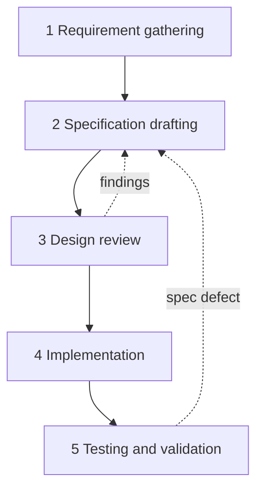

# Process

This project is built with Spec-Driven Development. The specification is written and reviewed before implementation begins, and it stays the contract that code is measured against.

## The five stages



The dotted edges matter as much as the solid ones. A design-review finding goes back to the specification, not forward into code. A test failure that turns out to be a specification defect does the same. Code is never the place a design decision is made for the first time.

**Why the gate is real.** During stage 3 an adversarial review found that none of the fourteen registered source URLs contained a deadline: all were index pages, with the decision-relevant fields a click deeper. Because the extraction schema is optional-typed, this would have failed silently in production, producing schema-valid records with null deadlines and no error anywhere. Caught at stage 3 it cost a registry rebuild. Caught at stage 5 it would have cost the fetch stage, the snapshot key and the eval harness.

## Which skill runs at which stage

Skills are invoked deliberately per stage rather than ad hoc.

| Stage | Skill | Purpose |
| --- | --- | --- |
| 1. Requirement gathering | `superpowers:brainstorming` | explore intent before committing to a design |
| | `firecrawl` | research the source landscape and the model landscape |
| 2. Specification drafting | `spec` (gstack) | turn intent into backlog-ready issues once the repo exists |
| | `diagram` (gstack) | architecture diagram; the `.mmd` is the single source of truth |
| | `claude-api` | authoritative model IDs, pricing and structured-output syntax |
| | `humanizer` | editing pass: tighten prose before a document ships |
| 3. Design review | adversarial subagents | independent architecture and fix review; findings applied, not filed |
| | `vibesec` | **the security gate**: anything touching secrets, the profile, or CI |
| 4. Implementation | `superpowers:writing-plans` | plan before code, every feature |
| | `superpowers:test-driven-development` | test first where practical |
| | `superpowers:subagent-driven-development` | execute plans with subagents |
| | `code-review` / `codex-review` | cross-model review of the working diff |
| 5. Testing and validation | `superpowers:verification-before-completion` | evidence before any completion claim |
| | `vibesec` | re-run before anything is published |

`vibesec` appears twice deliberately. It is the most important skill in this project, because the one unrecoverable mistake here is committing the real eligibility profile or leaking it by inference. It runs at design review and again before publication.

### Not yet installed

Four candidates from the open skills registry, searched and vetted by install count and source, none installed yet. Listed so the decision is on record rather than forgotten:

| Skill | Installs | Stage it would serve |
| --- | --- | --- |
| `hamelsmu/evals-skills@eval-audit` | 1.3K | 4, P2 eval design |
| `wshobson/agents@github-actions-templates` | 14.6K | 4, P3 cron workflow |
| `github/awesome-copilot@github-actions-hardening` | 434 | 4, P3 workflow security |
| `mindrally/skills@python-testing` | 872 | 4, pytest patterns |

`eval-audit` is the one with real leverage, since the regression-gated eval harness is the least conventional part of this build. The rest are covered by skills already installed. Install with `npx skills add <owner/repo@skill> -g -y`.

## Rules that hold across every stage

**No implementation code before the specification covering it is settled.** If something unanticipated surfaces mid-build, work stops, `SPEC.md` is amended, and only then does the code follow. Code-first and retrofit-the-doc-after is the pattern that makes a repository look improvised.

**Documents must agree.** `SPEC.md`, `docs/`, `diagrams/` and `config/` describe one system. A contradiction between them is a defect and is fixed as one. Two have been caught this way already: an architecture diagram still naming a superseded model, and a candidate list in the spec that no longer matched the model-selection document.

**Verification before assertion.** No claim that something works without the command output that shows it. Applies to test runs, to registry audits, and to any statement in a document.

**Findings are applied or explicitly declined.** A review whose output is a list nobody acts on is theatre. Where a finding is rejected, the reason is written down: `docs/model-selection.md` records rejected alternatives, and `SPEC.md` records superseded decisions rather than quietly deleting them.

## Current status

| Stage | State |
| --- | --- |
| 1. Requirement gathering | complete |
| 2. Specification drafting | complete |
| 3. Design review | three rounds complete and applied |
| 4. Implementation | P1 built and reviewed; P2 next |
| 5. Testing and validation | P1 acceptance run against the live registry, evidence in `docs/p1-acceptance.md` |

The gate for leaving stage 2 is mechanical rather than a judgement call:

```bash
python scripts/probe_sources.py
```

Every registered source must fetch, and every source with `role: watch` must contain a parseable deadline. A `discover` source is not failed for lacking one.

The probe reports three states: clean, failing, or unresolved. After the registry rebuild on 2026-09-03 it reported `13/13 sources clean, 0 unresolved, 0 failing`, and stage 2 closed on that result. A re-run on 2026-09-04 reported 12/13: the Knight-Hennessy deadlines page began returning 358 characters to a plain fetch with no dates and no deadline keywords, having yielded a date and eleven keywords the day before. The page went client-rendered, so the registry entry moved to the browser-rendering fetcher. The episode is worth recording rather than editing away: a watch source losing its deadline inside a day is precisely the breakage section 3.1's health check exists to catch, and it happened before the code that catches it was written.
